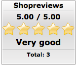
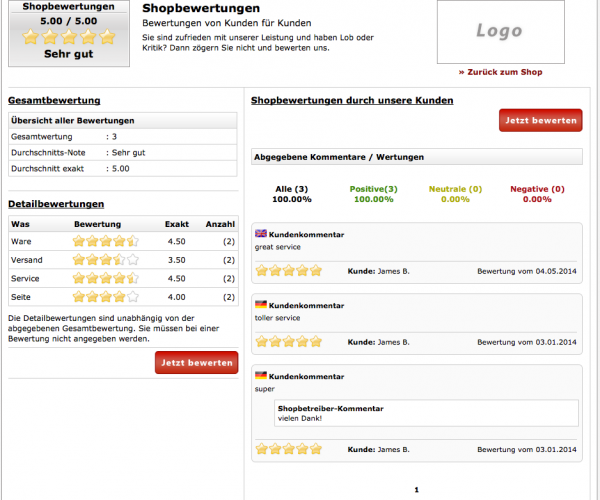
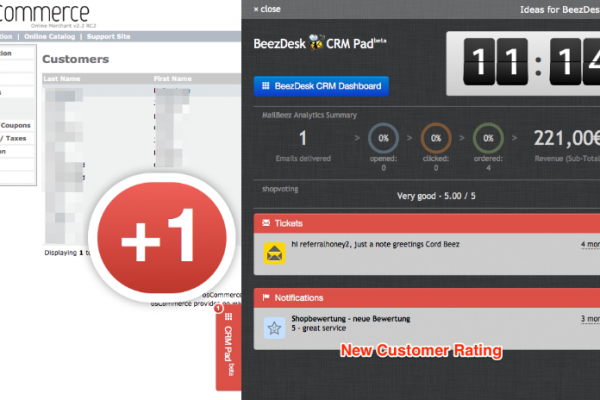

---
# http://learn.getgrav.org/content/headers
title: Shoprating
slug: config_shopvoting
# menu: Shoprating
date: 01-04-2014
published: true
publish_date: 01-04-2014
# unpublish_date: 01-04-2014
template: docs
# theme: false
visible: true
summary:
    enabled: true
    format: short
    size: 128
taxonomy:
    migration_status: done
    category: [docs]
    tag: [core]

# added collection selector

author:
    name: admin
metadata:
    author: admin
#      description: Your page description goes here
#      keywords: HTML, CSS, XML, JavaScript
#      robots: noindex, nofollow
#      og:
#          title: The Rock
#          type: video.movie
#          url: http://www.imdb.com/title/tt0117500/
#          image: http://ia.media-imdb.com/images/rock.jpg
#  cache_enable: false
#  last_modified: true
---

This popular module is developed by [www.web4design.de](http://www.web4design.de/) in close cooperation with MailBeez.

Plays well together with [Shoprating Invitation Advanced](/documentation/mailbeez/shoprating_advanced/) module with auto-login, frequent-buyer recognition and more pro features
 
 
### Installation

This module is already part of the MailBeez System. You only need to insert the code-snippet for displaying the badge into your store-front. Please [Go to integration manual](http://www.web4design.de/module_infos/english/shopreviews/index.php) for more information.
 

## customers reviews - self hosted

This add-on allows your customer to vote your stores and give a review.

With a nicely designed widget you can display the reviews in your shopping cart.

The design and layout is comparable to hosted solutions, but you have full control on your ratings - and all for free.

The module hooks into the [BeezDesk CRM Customer Insight](/documentation/configbeez/config_customer_insight/) so you will the notifications for new shopvotings. Also you are able to see shop voting for the customer you currently work on.

**following screenshots of the module:**

## More Information

### Looks great and improves conversion

The new MailBeez Shoprating Module allows your customers to rate your store and service. Hosted on your own server with complete control.

**Store-Ratings are known to increase conversion and for this good reason there are many online services for hosted Store-Ratings.**

However not everyone likes the idea of not having control on the ratings, sharing customer data and getting locked into a monthly fee. That’s why we teamed up with **[www.web4design.de](http://www.web4design.de/)**, who has developed a beautiful and great working for self-hosted store ratings already helping 1000's of online stores to increase conversion.
 
**Store ratings or product reviews? Both!**   
Store ratings and [product reviews](/documentation/mailbeez/review_advanced/) are complementary, so you can use them both in your store.

We recommend to ask your customers for a store rating short after delivery and e.g. 30 days later for a review of their purchased products. **Two natural points of contact** which improve your **customer interaction** and **brand recognition** - and will increase your revenue!

### Professional Rating-Page included

Clicking on the badge opens a professional designed page showing details about the ratings and allowing customers to place a new rating as well (better invite them using MailBeez ;) ).

### Get serious - go advanced

While the free module already works great, professional stores will go for the MailBeez Premium add-on "[Shoprating Invitation Advanced](/documentation/mailbeez/shoprating_advanced/)" which provides a range of advanced features like **auto-login** and **recognition of regular customers** which will generate up to twice as many ratings. And you can even **integrate real-time ratings in any MailBeez-generated Email** by placing a simple template tag in MailBeez Emails

 [go to Shoprating Invitation Advanced](/documentation/mailbeez/shoprating_advanced/)

### Integrated into free BeezDesk CRM Customer Insight

Just integrate the free [BeezDesk CRM Customer Insight](/documentation/configbeez/config_customer_insight/)  into your Store Admin panel by adding a single code-line and you will get **notified about new customer ratings**, see the current rating summary and have **direct access to the configuration panel** of the MailBeez Shoprating Module!

[How to integrate BeezDesk CRM Customer Insight?](/documentation/configbeez/config_customer_insight/)