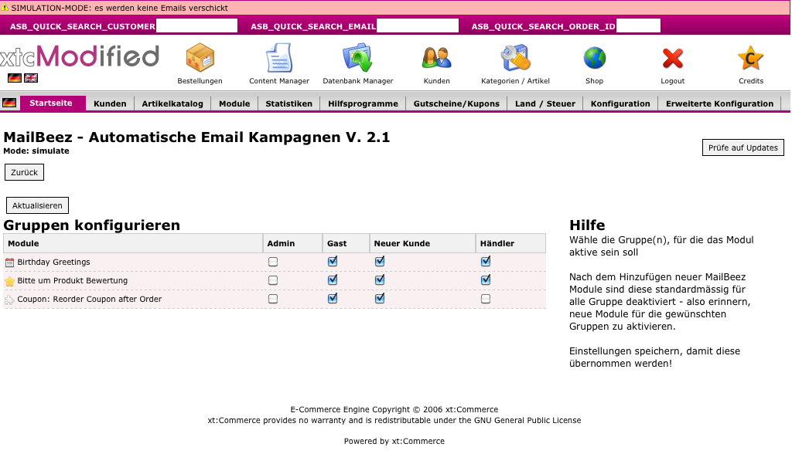

---
# http://learn.getgrav.org/content/headers
title: Customer Group Filter
slug: filter_check_group
# menu: Customer Group Filter
date: 27-05-2011
published: true
publish_date: 27-05-2011
# unpublish_date: 27-05-2011
template: docs
# theme: false
visible: true
summary:
    enabled: true
    format: short
    size: 128
taxonomy:
    migration_status: done
    category: [docs]
    tag: [pro]
module:
    code: 'filter_check_group'
    category: [filterbeez]
    compatiblity: [comp_zencart,comp_xtc,comp_gambio,comp_cre]
    pro: 'pro'
    cert: 'true'
    price: '99 EUR'
# added collection selector

author:
    name: admin
metadata:
    author: admin
#      description: Your page description goes here
#      keywords: HTML, CSS, XML, JavaScript
#      robots: noindex, nofollow
#      og:
#          title: The Rock
#          type: video.movie
#          url: http://www.imdb.com/title/tt0117500/
#          image: http://ia.media-imdb.com/images/rock.jpg
#  cache_enable: false
#  last_modified: true
---

**Please Note: This module is only compatible with Zen Cart, CRE Loaded B2B, xt:Commerce, xtc-Modified and Gambio GX systems.**

If you sell to different customer groups, then the Customer Group Filter is for you! This handy module gives you complete control of your email sends, by allowing you to target specific customer groups to recieve your various Mailbeez campaigns.

Configuration in ZenCart

Configuration in Modified Shop

Since different market sectors will almost certainly have individual marketing needs, segmenting customers into groups is a great idea!

For example, you probably don’t want a wholesale customer to receive a product review request, or an end user customer to receive a product offer at the wholesale price.

The Mailbeez Group Filter module gives you the ability to choose which group is authorized to receive a campaign.

>>>>>>the customer group filter enhances the segmentation rules e.g. used in [Newsletter Advanced](/documentation/mailbeez/newsletter) Module!
