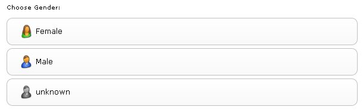
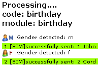

---
# http://learn.getgrav.org/content/headers
title: Add Gender
slug: filter_add_gender
# menu: Add Gender
date: 08-04-2011
published: true
publish_date: 08-04-2011
# unpublish_date: 08-04-2011
template: docs
# theme: false
visible: true
summary:
    enabled: true
    format: short
    size: 128
taxonomy:
    migration_status: done
    category: [docs]
    tag: [pro]
module:
    code: 'filter_add_gender'
    category: [filterbeez]
    compatiblity: [comp_osc,comp_cre,comp_digi,comp_zencart,comp_xtc,comp_gambio]
    thumbnail: 'http://www.mailbeez.com/wp-content/uploads/downloads/thumbnails/2011/04/icon_321.png'
    pro: 'pro'
    cert: 'true'
    price: '79 EUR'
    title_en: 'Add Gender'
    teaser_en: 'Different Email Content for men / women'
    title_de: 'Geschlechtsabh&auml;ngige Emails'
    teaser_de: 'Verschiedene Emails f&uuml;r Damen und Herren'
    author: 'MailBeez.com'
# added collection selector

author:
    name: admin
metadata:
    author: admin
#      description: Your page description goes here
#      keywords: HTML, CSS, XML, JavaScript
#      robots: noindex, nofollow
#      og:
#          title: The Rock
#          type: video.movie
#          url: http://www.imdb.com/title/tt0117500/
#          image: http://ia.media-imdb.com/images/rock.jpg
#  cache_enable: false
#  last_modified: true
---

 

This module adds gender information to all of your MailBeez email modules. It allows you to email your customers based on gender, resulting in a higher degree of reader relevancy, in turn, making customers less likely to unsubscribe for receiving emails about products that don’t interest them.

The module supports full gender recognition during testing & simulation to enable a full and complete test.

Choose which gender you want to use when sendning test-emails:



When you run an email module, recipients are displayed by gender:




In your email template you can use some logic to generate different output by gender:

```
{if $gender == "f"}
   Dear Mrs. {$lastname}
{elseif $gender == "m"}
   Dear Mrs. {$lastname}
{else}
   Hello {$firstname} {$lastname}
{/if}

```

in the visual editor use the following code to protect the tags from editing

```
[[if $gender == "f"]]
   Dear Mrs. [[$lastname]]
[[elseif $gender == "m"]]
   Dear Mr. [[$lastname]]
[[else]]
   Hello [[$firstname]] [[$lastname]]
[[/if]]

```

The gender specific personalisation is not limited to the salutation but you can even personalize content sections - even in the common main template - by gender.
