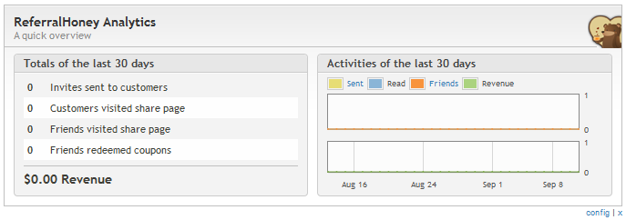

---
# http://learn.getgrav.org/content/headers
title: The ReferralHoney Analytics Widget
slug: dashboard_coupon_referral_honey
routes:
    aliases:
        - /documentation/dashboardbeez/referralhoney-analytics
        
# menu: The ReferralHoney Analytics Widget
date: 17-10-2012
published: true
publish_date: 17-10-2012
# unpublish_date: 17-10-2012
template: docs
# theme: false
visible: true
summary:
    enabled: true
    format: short
    size: 128
taxonomy:
    migration_status: done
    category: [docs]
    tag: [pro]
module:
    code: 'coupon_referral_honey'
    category: [dashboardbeez]
    compatiblity: [comp_cre,comp_digi,comp_zencart,comp_xtc,comp_gambio]
    pro: 'pro'
    cert: 'true'      
# added collection selector

author:
    name: kelly
metadata:
    author: kelly
#      description: Your page description goes here
#      keywords: HTML, CSS, XML, JavaScript
#      robots: noindex, nofollow
#      og:
#          title: The Rock
#          type: video.movie
#          url: http://www.imdb.com/title/tt0117500/
#          image: http://ia.media-imdb.com/images/rock.jpg
#  cache_enable: false
#  last_modified: true
---

Delivered with the [ReferralHoney](/documentation/mailbeez/coupon_referral_honey) module this is a powerful widget with an intuitive graph display that provides you with a visual report of your ReferralHoney statistics, such as number of invites sent, number of resulting site visits, number of coupons redeemed, and more!

 By default, it displays 30 days worth of data, but this number of days can be changed in the widget’s configuration settings.

When ReferralHoney is first installed, there won’t be a graph displayed by this widget because there has been no data tracked and therefore nothing to display. Once you get ReferralHoney up and running, this widget will be populated with data in no time at all!
